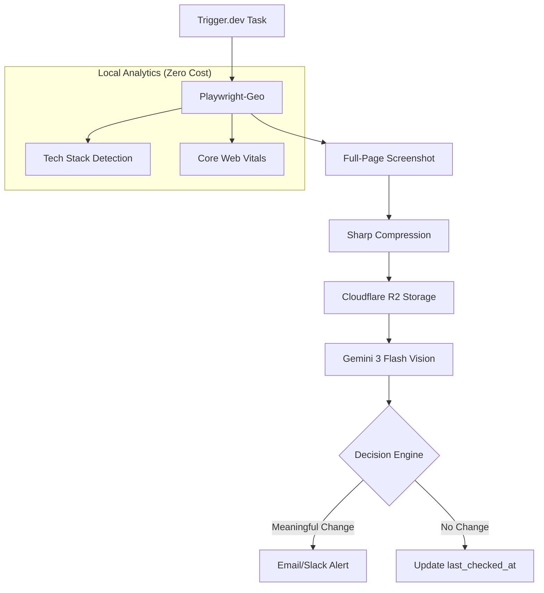

# RivalEye: System Design & Unit Economics

This document provides a technical and financial blueprint of RivalEye's vision-first intelligence architecture.

## 🏗️ Intelligence Architecture

RivalEye utilizes a **Vision-First Intelligence Cascade**. Instead of fragile DOM-scraping, we rely on visual reasoning via **Gemini 3 Flash** to extract multi-dimensional insights from a single captured state.

### 1. Data Flow Diagram

### 2. The Intelligence Cascade
| Tier | Method | Cost | Purpose |
| :--- | :--- | :--- | :--- |
| **Tier 1** | Local Signatures | $0.00 | Tech Stack & Performance |
| **Tier 2** | Vision Extraction | <$0.01 | Pricing, Promo, & Positioning |
| **Tier 3** | Firecrawl (Fallback) | $0.05 | High-fidelity branding extraction* |

*\*Note: We are phasing out Tier 3 in favor of Tier 2 Vision extraction to maximize margins.*

### 3. Provider Free Tier & Paid Scaling
| Service | Free Tier Limits | Paid Tier (Post-Free) |
| :--- | :--- | :--- |
| **Gemini 3 Flash** | 250 - 1,000 req/day | Input: $0.50/M, Output: $3.00/M |
| **Firecrawl** | 500 total credits | Hobby: $19/mo (3k credits) |
| **Trigger.dev** | 1,200-run bucket (100/10s refill) | ~$30/mo (20+ concurrent) |
| **Resend** | 3,000 emails/mo (100/day) | Usage-based (scales with volume) |

---

## 💰 Unit Economics (Pro Tier)

### Per-Scan Variable Costs (COGS)
Assuming a Pro user tracking **5 competitors** daily.

| Line Item | Provider | Cost per Scan | Monthly (150 scans) |
| :--- | :--- | :--- | :--- |
| **Compute** | Trigger.dev | ~$0.005 | $0.75 |
| **Storage** | Cloudflare R2 | ~$0.0001 | $0.015 |
| **Intelligence**| Gemini 3 Flash | ~$0.005 | $0.75 |
| **Email** | Resend | Negligible | $0.00 |
| **Total** | | **$0.0101** | **$1.515** |

### Gross Margin Calculation
*   **Pro Subscription**: $19.00 / mo
*   **Variable Cost**: ~$1.52 / mo
*   **Gross Profit**: ~$17.48 / mo
*   **Gross Margin (%)**: **~92%**

---

## 📈 Scalability & Guardrails

### 1. The Volatility Decay
If a competitor's page hasn't changed in 30 days, RivalEye automatically reduces check frequency by 50% to conserve resources while maintaining "silent" monitoring.

### 2. Rate Limit Handling
The system implements a global rate limiter to prevent simultaneous hits to the same competitor destination, avoiding IP bans and ensuring reliability.

### 3. Verification Buffer
All AI-extracted data is stored alongside the R2 screenshot link, allowing users to verify every insight with one click. This solves the "AI Hallucination" trust gap.
